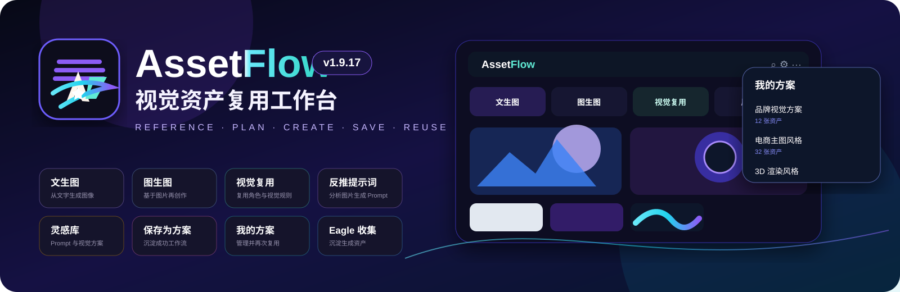

  <a href="./README.md">简体中文</a> · <strong>English</strong>

  

<h1 align="center">AssetFlow</h1>

  <strong>Turn references, prompts, generation settings, and visual rules into traceable and reusable creative workflows.</strong>

Reference · Plan · Create · Save · Reuse

  
  
  
  
  

---

## What is AssetFlow?

AssetFlow is an AI visual asset reuse workspace for Chrome and Edge.

It is designed to preserve more than a single generated image. AssetFlow keeps the reusable parts of a creative session together, including:

- reference images and their roles
- core creative requirements
- structured ReusePlan data
- prompts and generation parameters
- model, size, ratio, and text strategy
- source lineage and asset relationships
- successful personal workflows

The product loop is:

Reference → Plan → Create → Save → Reuse

AssetFlow is especially useful for posters, commercial KV, e-commerce visuals, character / IP extensions, scene replacement, product relocation, style reuse, and multi-reference image workflows.

---

## Core Features

| Feature | What it does |
| --- | --- |
| Text-to-image | Generate visuals directly from a prompt |
| Image-to-image | Continue creating from local or web images |
| Visual reuse | Assign roles such as subject, composition, layout, color, style, and decoration to 1–4 references |
| Prompt reverse engineering | Analyze an image and generate reusable prompt language |
| ReusePlan | Structure what should stay, what can change, and which reference controls each visual dimension |
| Inspiration Library | Browse reusable Prompt Recipes and Visual Recipes |
| Save as Recipe | Turn a successful image-to-image or visual reuse result into a personal recipe |
| My Recipes | Search, rename, edit, delete, and reuse personal visual recipes |
| Local Gallery | Persist generated results locally across Side Panel reopen |
| Viewer | Inspect full images, prompts, sources, references, and lineage on the current page |
| Continue Creating | Restore a generated asset back into text-to-image, image-to-image, or visual reuse mode |
| Eagle Collection | Send generated assets to Eagle |
| Multi-provider support | Configure analysis and image-generation providers independently, including custom OpenAI-compatible services |

---

## How Visual Reuse Works

A typical image-to-image workflow is simply:

Reference + Prompt

AssetFlow instead lets different references play different roles. For example:

- Image 1 → Subject & Action
- Image 2 → Composition & Negative Space
- Image 3 → Style & Material

You then add a concise requirement such as “create a new technology product poster.”

AssetFlow builds a structured ReusePlan that describes:

- what must be preserved
- what may change
- which reference controls which visual dimension
- how text should be handled
- what the final asset should be

The ReusePlan is then compiled into the final prompt and sent to the selected image-generation provider.

This is more reliable than simply sending several images to a model without explicitly defining their responsibilities.

---

## v1.9.17: From Generation to Reusable Workflows

v1.9.17 adds a complete personal visual recipe loop:

Generate a good result → Viewer → Save as Recipe → My Recipes → upload new references later → restore roles / requirements / parameters → generate again

A saved personal recipe keeps:

- reference role structure
- core requirement
- preserve / change rules
- text strategy
- prompt
- model
- aspect ratio and size
- ReusePlan
- independent preview image

By default, AssetFlow does not permanently copy the original reference images into a personal recipe. It stores the workflow structure instead. This reduces local storage usage and makes the recipe reusable with new source material.

---

## Inspiration Library

Current built-in recipe pool:

| Type | Total | Ready to use | Case research |
| --- | ---: | ---: | ---: |
| Prompt Recipe | 13 | 12 | 1 |
| Visual Recipe | 10 | 7 | 3 |

There are currently 19 ready-to-use built-in recipes.

Prompt Recipes are designed for direct prompt copy / apply workflows. Visual Recipes include reference roles, preserve / change rules, and a target structure.

Personal recipes use the `personal` status and are not counted as official verified recipes.

- [Current Recipe Status](docs/recipe-status.md)
- [v1.9.17 Personal Recipe Implementation & Validation](docs/user-recipes-v1.9.17.md)

---

## Typical Workflows

### 1. Text-to-image

Text-to-image → enter prompt → choose model / ratio / size → generate → Viewer

### 2. Single-image editing

Image-to-image → upload image → enter requirement → generate → Viewer → continue image editing

### 3. Multi-reference visual reuse

Upload 1–4 references → assign roles → enter one core requirement → review plan → AI builds ReusePlan → Prompt Compiler → generate → inspect sources in Viewer

### 4. Save and reuse a successful workflow

Viewer → Save as Recipe → My Recipes → Use Recipe → upload new references → restore roles and parameters → generate again

---

## Supported Reference Roles

| Role | Best used for |
| --- | --- |
| Subject & Action | People, products, IP characters, poses, primary structure |
| Composition & Negative Space | Camera angle, placement, spatial structure, framing |
| Layout & Text | Grid, title area, information hierarchy |
| Color & Material | Palette, lighting, material appearance |
| Style & Material | Photography, illustration, 3D, visual language |
| Decoration & Detail | Small elements, atmosphere, local details |

Per-reference strength and lock controls are available in advanced settings.

> Reference strength is primarily used as semantic guidance inside ReusePlan / Prompt compilation. Native per-image numeric weighting is not supported by every provider, and AssetFlow does not pretend that unsupported provider-level weighting exists.

---

## Installation

Current version: v1.9.17

### Load from source

1. Clone or download this repository.
2. Run `npm run package` in the project directory.
3. Open your browser extension manager:
   - Chrome: `chrome://extensions`
   - Edge: `edge://extensions`
4. Enable Developer Mode.
5. Choose “Load unpacked”.
6. Select `dist/assetflow`.

The packaging script also creates `dist/assetflow-v1.9.17.zip` for archiving or distribution.

### Updating an older installation

If an older version was loaded from `dist/lyz-assetflow` or `dist/image-prompt-builder`, run `npm run package` and click “Reload” in the extension manager. You usually do not need to remove and reinstall the extension.

---

## API Configuration

AssetFlow manages analysis / reverse-prompt APIs separately from image-generation APIs, so you can mix providers freely.

### Analysis and visual understanding

- Grsai Chat API
- Google Gemini
- Alibaba Cloud Bailian Qwen-VL
- Volcano Engine Ark
- Custom OpenAI-compatible Chat API

### Image generation

- Grsai GPT Image
- RunningHub
- APIMart
- Jimeng / Seedream-related configurations
- Custom OpenAI-compatible Image API

Provider capabilities vary. Multi-image input, supported resolutions, and asynchronous task behavior are adapted according to the actual provider API.

<strong>Grsai example</strong>

Analysis: Settings → Analysis → Grsai Chat API.

Image generation: Settings → Image Generation → Grsai GPT Image API.

Default mainland China endpoint: `https://grsai.dakka.com.cn`

Global endpoint: `https://grsaiapi.com`

AssetFlow supports asynchronous submit / query flows and restores unfinished tasks after reopening the Side Panel.

<strong>Gemini / Qwen-VL / Ark</strong>

Google Gemini default Base URL: `https://generativelanguage.googleapis.com/v1beta`

Alibaba Cloud Bailian OpenAI-compatible Base URL: `https://dashscope.aliyuncs.com/compatible-mode/v1`

Volcano Engine Ark Base URL: `https://ark.cn-beijing.volces.com/api/v3`

<strong>RunningHub</strong>

AssetFlow supports consumer AI-app mode, enterprise Standard API, and the official stable Standard API.

Submission, upload, query, and asynchronous task recovery are handled separately for the supported RunningHub modes.

---

## Local Data & Privacy

AssetFlow follows a local-first approach for workspace and personal asset management.

The following are stored in the current browser profile:

- local gallery
- workspace state
- personal visual recipes
- independent recipe previews
- API configuration

Personal recipes are persisted using IndexedDB.

### Not included in v1.9.17

- account system
- cloud sync
- online marketplace
- community sharing
- automatic upload of personal recipes
- automatic permanent storage of original reference images inside personal recipes

> When you call a third-party AI provider, the prompt and/or images required by that provider are sent to the selected service according to its API contract. Data handling therefore also depends on the provider you choose.

---

## Viewer & Source Lineage

The Viewer can display:

- full-resolution result
- prompt summary / full prompt
- model and output size
- generation sources
- reference images
- reference roles
- direct / analysis-only source relationships
- generated gallery

It also supports:

- Use This Prompt
- Image-to-Image Edit
- Restore Visual Reuse
- Save as Recipe
- Download
- Eagle collection

Older assets with incomplete lineage are not assigned fabricated source information.

---

## Local Gallery & Async Recovery

Generated assets are stored in the local gallery.

For providers with asynchronous jobs, AssetFlow persists task information so the flow can continue after the Side Panel is closed:

Submit task → close Side Panel → provider finishes in background → reopen → recover result

v1.9.16 fixed:

- image-to-image continuation losing its reference after reopen
- duplicate gallery records for the same asynchronous result

AssetFlow now uses stable IndexedDB image references and `generationId / resultIndex` for idempotent result persistence.

---

## Eagle

The Viewer includes “Collect to Eagle”. AssetFlow prefers the locally persisted original image from IndexedDB instead of relying on temporary provider image URLs.

Eagle must be installed and running locally.

---

## Current Validation Status

v1.9.17 has passed:

- `npm run check`
- `git diff --check`
- `npm run package`
- GitHub Actions CI
- real browser-extension smoke tests
- IndexedDB v2 → v3 migration
- repeated Side Panel reopen
- full test-profile restart
- personal recipe save / edit / delete
- independent preview persistence
- Gallery / Recipe deletion isolation
- 1-reference / 3-reference personal recipe reuse
- storage transaction rollback tests

v1.9.16 already completed live Grsai Provider E2E coverage for 1 / 2 / 3-reference visual reuse.

The new v1.9.17 “save recipe → reuse recipe” path was validated at the existing provider boundary without unnecessarily spending another round of live image-generation API usage.

- [v1.9.17 Validation Report](docs/user-recipes-v1.9.17.md)
- [Machine-readable Validation Record](docs/validation/user-recipes-v1.9.17.json)
- [Recipe Status](docs/recipe-status.md)

---

## Development

- Local preview: `npm run preview`
- Project checks: `npm run check`
- Package extension: `npm run package`

GitHub Actions automatically runs project checks, `git diff --check`, and packaging.

---

## Current Scope

v1.9.17 does not yet include:

- saving text-to-image results as personal Prompt Recipes
- personal recipe cloud sync
- share links
- import / export
- favorites / recent items
- recipe version history
- marketplace
- dedicated live Provider E2E for the analysis-only lineage branch

These limitations do not block the current text-to-image, image-to-image, visual reuse, Viewer, Inspiration Library, or personal visual recipe workflows.

---

  <strong>AssetFlow v1.9.17</strong> 
  Reference · Plan · Create · Save · Reuse

